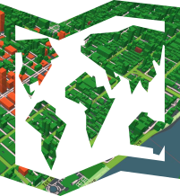

# NightVision 
This is a map style that uses a publically available [Tegola](https://github.com/terranodo/tegola) extract of OpenStreetMap for the world. It is currently still under development and is primarily styled using [Maputnik](https://github.com/maputnik/editor).

## Viewing the map in the browser
- [Rendered with OpenLayers:](http://htmlpreview.github.io/?https://github.com/PetersonGIS/NightVision/blob/master/live-map.html)
Note that the road labels and tilt functionality are missing from this map, which displays the night-vision.json style.
- [Rendered with Mapbox:](http://www.gretchenpeterson.com/live-map-mapbox-night-vision.html) 
  Note that the road labels, and tilt are working in this map, which displays the night-vision3d.json style. Test the tilt (pitch)   functionality by holding ctrl while clicking and dragging. The building extrusions are not yet functional on mobile devices.

## Map Design

The NightVision basemap has a bright and homogeneous color scheme to contrast with dark backgrounds and satellite backgrounds in particular. Use night-vision.json for OpenLayers or mobile and night-vision3d.json for Mapbox implementations. Use either night-vision.json or night-vision3d.json in Maputnik for building your own style with Tegola data. It's expected that the background would be replaced with a satellite layer and the transparency of the two land layers, and any other polygons as desired, would be modified to allow the satellite layer to show through. 

## Editing this style in Maputnik

Editing this style to create your own style.json file is fairly straightforward. Point your browser to Maputnik at  [http://maputnik.com/editor/](http://maputnik.com/editor/), click Open > Upload and point to either night-vision.json or night-vision3d.json, which you have saved locally. Change the style to suit you, then go to Export > Download to save your newly re-styled json file locally. This can then be used in a renderer like OpenLayers or Mapbox for browser display. Note that night-vision.json and night-vision3d.json use data extracted from OSM and hosted using Tegola. You may want to explore using other open tilesets as well.

